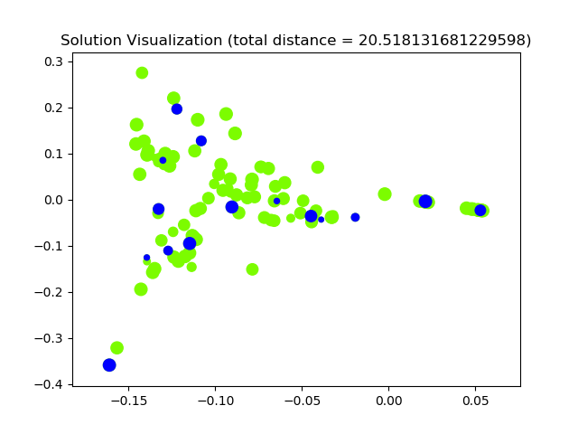

# ILS-SUMM
# [Note: this repo is not final. It will be updated at 26.9.2019 13:00.]  
This repo contains a python implementation of the paper - "ILS-SUMM: Iterated Local Search for Unsupervised Video Summarization" (under the review of ICLR 2020).  
The main requirements are python 3.6 and moviepy. Please install other missing dependencies.

  
*A video summary of [Cosmus Laundromat movie](https://www.youtube.com/watch?v=Y-rmzh0PI3c) generated by ILS-SUMM.*  

## Get started
1. Download the code
```bash
git clone https://github.com/ICLR-2020-ILS-SUMM/ILS-SUMM.git
```
2. Copy your video file and the features and durations of your video shots into the data directory. By default, the data directory contains the fetures and durations we use for the [Cosmus Laundromat movie](https://www.youtube.com/watch?v=Y-rmzh0PI3c). 
```bash
cp /<yourdatadir>/{features.npy,shots_durations.npy,yourvideo.mp4} /data/
```

## How to run ILS-SUMM
Run demo.py with the video file name and allowed summarization ratio as arguments.  
For example, assigning 0.1 to summ_ratio means the maximum length of the summary will be 10% of the full video length.
```bash
python demo.py <video_file_name> <summ_ratio>
```
## Example
For the [Cosmus Laundromat movie](https://www.youtube.com/watch?v=Y-rmzh0PI3c) we get the following results:
```bash
The achieved total distance is: 13.573437896524624  
The selected shots are: [  2   4   8   9  11  20  24  31  39  42  45  47  53  55  56  64  72  74
  75  77  78  79  84  85  88 102]
```



