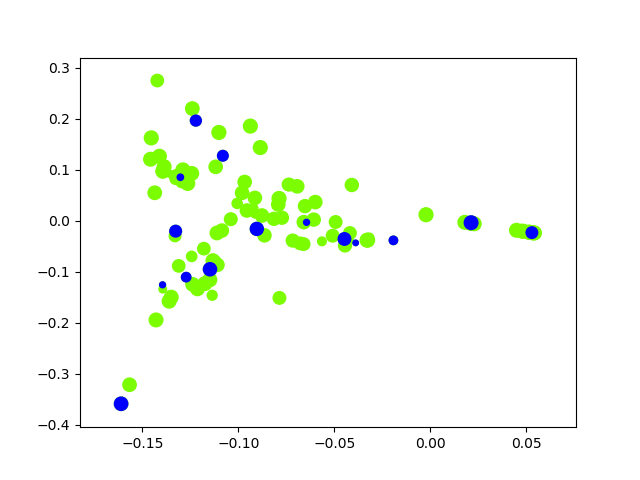

# ILS-SUMM
This repo contains a python implementation of the paper - [ILS-SUMM: Iterated Local Search for Unsupervised Video Summarization](https://arxiv.org/abs/1912.03650) (ICPR 2020 paper).
The main requirements are python 3.6 and [moviepy](https://zulko.github.io/moviepy/install.html). Please install other missing dependencies.

[](https://github.com/ICLR-2020-ILS-SUMM/ILS-SUMM/blob/master/data/video_summary.mp4?raw=true)  
*A [video summary](https://github.com/ICLR-2020-ILS-SUMM/ILS-SUMM/blob/master/data/video_summary.mp4?raw=true) of [Cosmus Laundromat movie](https://www.youtube.com/watch?v=Y-rmzh0PI3c) generated by ILS-SUMM.*  

## Get started
1. Download the code
```bash
git clone https://github.com/ICLR-2020-ILS-SUMM/ILS-SUMM.git
```
2. Copy your video file and the features and durations of the video shots into the data directory. Currently, the data directory contains the features and durations we use for the Cosmus Laundromat movie.
```bash
cp /<yourdatadir>/{shots_features.npy,shots_durations.npy,yourvideo.mp4} /data/
```

## How to run ILS-SUMM
Run demo.py with the video file name and the allowed summarization ratio as arguments.  
For example, assigning 0.1 to summ_ratio means the maximum length of the summary will be 10% of the full video length.
```bash
python demo.py <video_file_name> <summ_ratio>
```
## Example
For Cosmus Laundromat, we get the following results:
```bash
The selected shots are: [  2   6   8  39  42  45  47  50  72  75  77  78  79  88 102]
The achieved total distance is: 20.518
```
To illustrate the solution, the following figure will be saved in the data directory:
  
The features dimension was reduced to two dimensions using PCA. The point radius is proportional to the shot duration, and blue color denotes the shots that were chosen by ILS-SUMM algorithm.

## Datasets
The datasets we used in the paper can be found [here](https://github.com/YairShemer/ILS-SUMM/tree/master/datasets).  
A description of the datasets is [here](datasets/Datasets%20Description.md).

## Citation
```bash
@article{shemer2019ils,
  title={ILS-SUMM: Iterated Local Search for Unsupervised Video Summarization},
  author={Shemer, Yair and Rotman, Daniel and Shimkin, Nahum},
  journal={arXiv preprint arXiv:1912.03650},
  year={2019}
}
```


